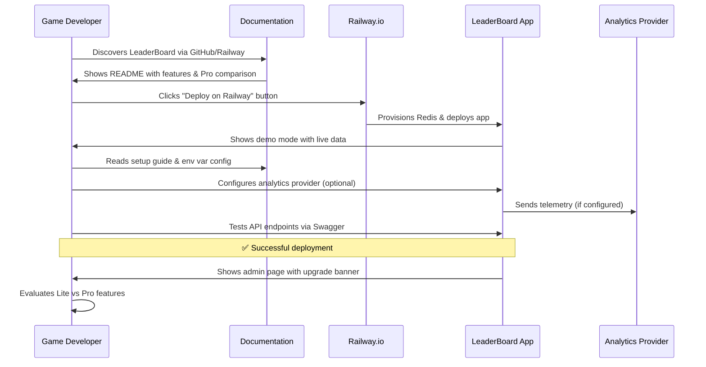
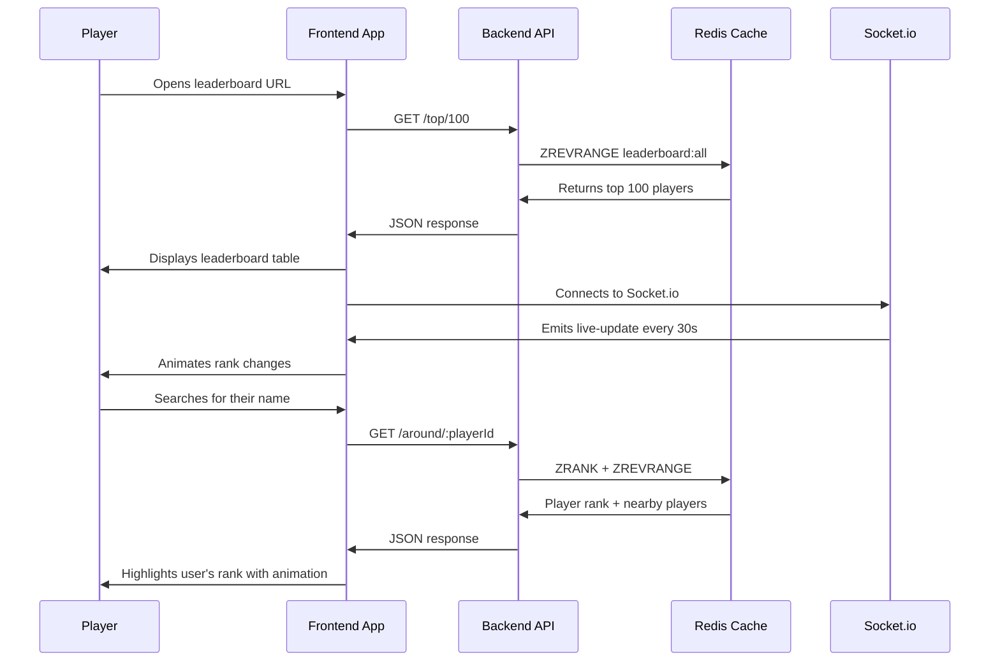
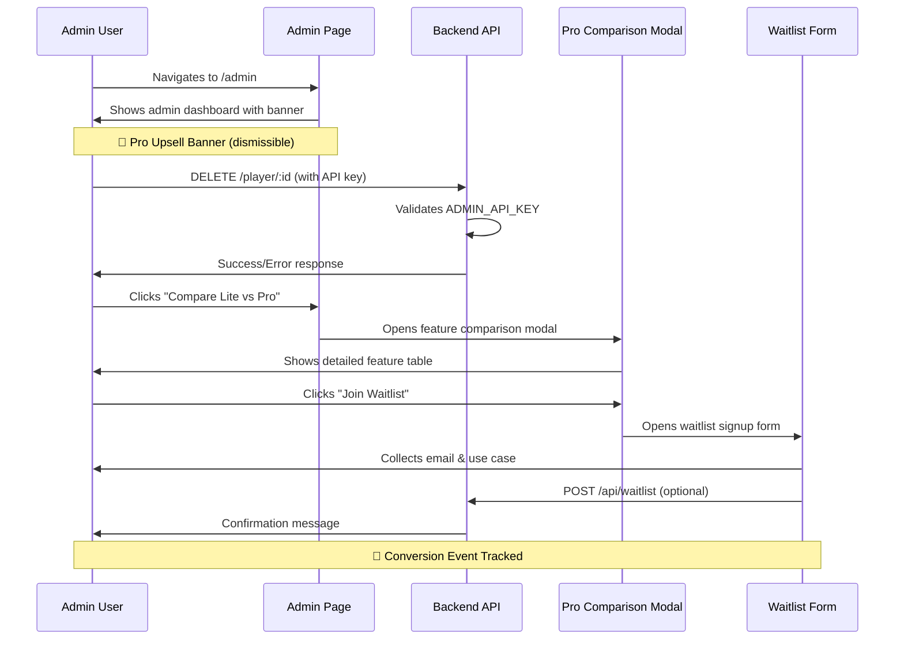
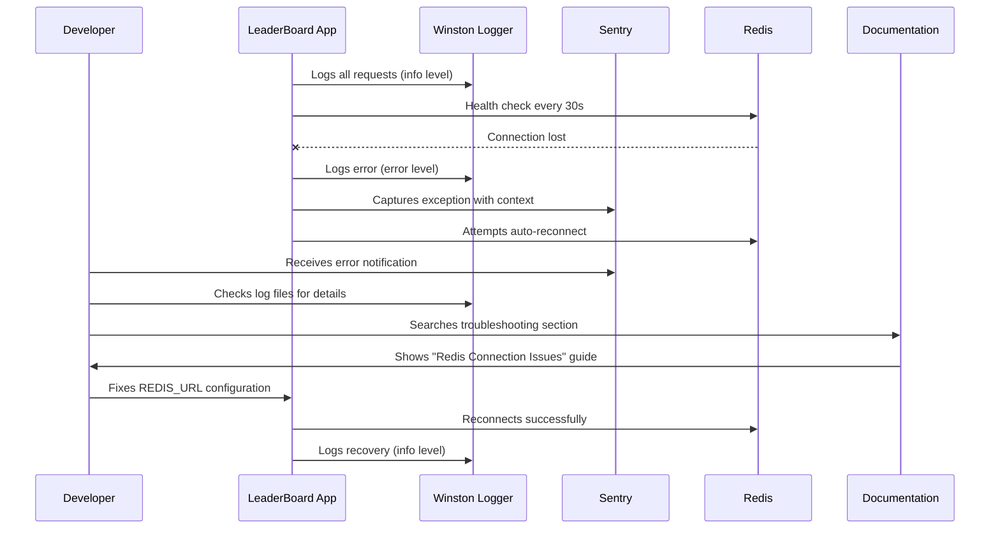
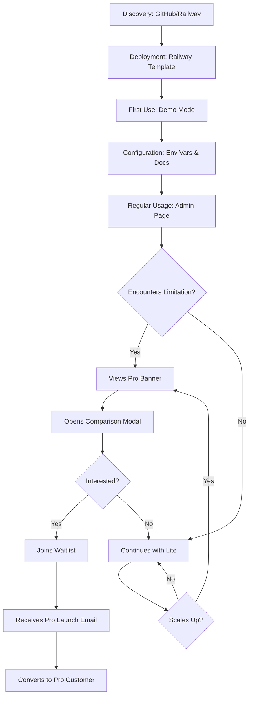
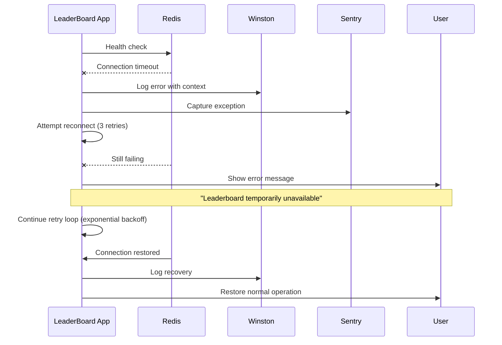
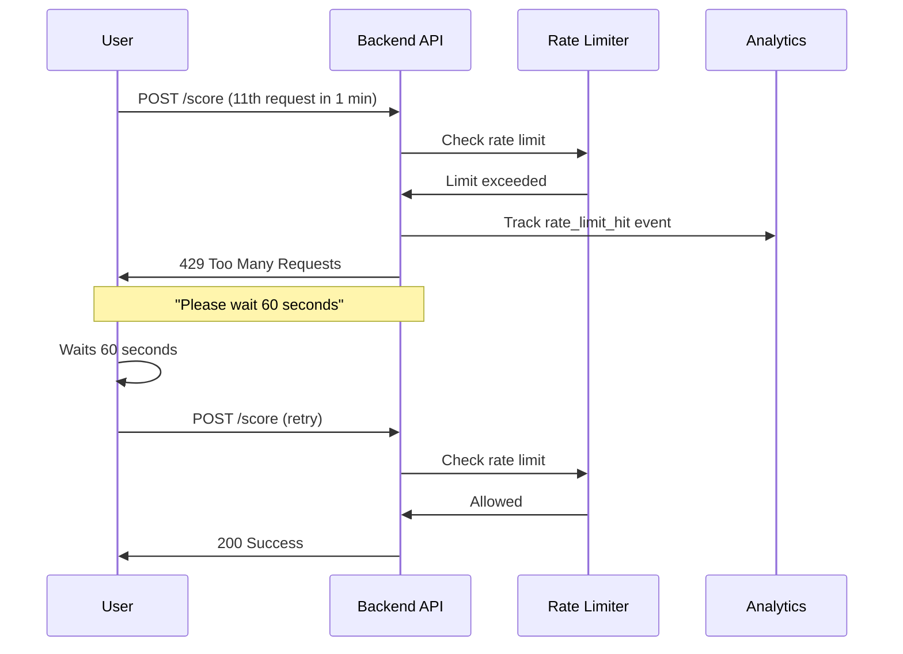

# Core Flows: User Journeys & Pro Conversion Paths

# Core Flows: User Journeys & Pro Conversion Paths

## Overview

This document maps out the key user flows for the enhanced LeaderBoard application, focusing on how users interact with new features and where Pro conversion touchpoints are strategically placed.

## User Personas

### 1. End User (Player)
- **Goal**: View leaderboard rankings, track personal progress
- **Needs**: Fast loading, mobile-friendly, real-time updates
- **Conversion Potential**: Low (not primary target)

### 2. Game Developer (Deployer)
- **Goal**: Deploy leaderboard for their game quickly
- **Needs**: Easy setup, good documentation, reliable performance
- **Conversion Potential**: High (primary Pro conversion target)

### 3. Admin/Moderator
- **Goal**: Manage leaderboard, moderate players, monitor performance
- **Needs**: Admin tools, monitoring dashboards, security controls
- **Conversion Potential**: Very High (Pro features directly address pain points)

## Primary User Flows

### Flow 1: First-Time Deployment (Game Developer)



**Key Touchpoints:**
1. **README comparison table** - First exposure to Pro features
2. **Demo mode** - Immediate value demonstration
3. **Admin page banner** - Contextual upgrade prompt
4. **Documentation quality** - Builds trust and confidence

**Enhancement Integration:**
- 📊 Analytics: Tracks deployment success rate
- 📚 Documentation: Comprehensive setup guide with video tutorial
- 🎨 UX: Demo mode showcases real-time features
- 🔒 Security: Clear security best practices in docs

---

### Flow 2: Regular Usage (End User - Player)



**Key Touchpoints:**
- **Mobile responsive design** - Seamless experience on all devices
- **Rank change animations** - Engaging visual feedback
- **Theme customization** - Branded experience (if configured)
- **Performance** - Fast loading with Redis caching

**Enhancement Integration:**
- 🎨 UX: Mobile responsive, animations, theme support
- 📊 Analytics: Tracks user engagement (page views, search usage)
- 🔍 SEO: Meta tags for social sharing
- ♿ Accessibility: ARIA labels, keyboard navigation

---

### Flow 3: Admin Management & Pro Discovery



**Key Touchpoints:**
1. **Admin page banner** - Non-intrusive, dismissible upgrade prompt
2. **Feature comparison modal** - Detailed Lite vs Pro comparison
3. **Waitlist CTA** - Low-friction conversion action
4. **Admin pain points** - Highlights Pro features (multi-tenancy, anti-cheat, auth)

**Enhancement Integration:**
- 🚀 Pro Upsell: Banner, modal, waitlist form
- 🔒 Security: Improved API key validation
- 📊 Analytics: Tracks banner views, modal opens, waitlist signups
- 📚 Documentation: Links to Pro feature docs

---

### Flow 4: Monitoring & Troubleshooting (Developer)



**Key Touchpoints:**
- **Sentry alerts** - Proactive error notifications
- **Winston logs** - Detailed debugging information
- **Troubleshooting docs** - Common issues and solutions
- **Health checks** - Prevents crashes, enables auto-recovery

**Enhancement Integration:**
- 📊 Monitoring: Winston + Sentry configured
- 🔧 Scalability: Redis health checks, auto-reconnect
- 📚 Documentation: Comprehensive troubleshooting guide
- 🔒 Security: Logs security events (rate limit hits, auth failures)

---

## Pro Conversion Funnel

### Conversion Path Stages



### Conversion Triggers

| Trigger | User Action | Pro Feature Highlighted | Conversion Likelihood |
|---------|-------------|------------------------|----------------------|
| **Multi-game deployment** | Tries to deploy 2nd instance | Multi-Tenancy | Very High |
| **Cheating concerns** | Sees suspicious scores | Anti-Cheat System | High |
| **User management** | Wants player accounts | User Authentication | High |
| **Advanced moderation** | Needs ban/unban features | Admin Dashboard | Medium |
| **Scale concerns** | High traffic issues | Enterprise Support | Medium |

---

## UI Wireframes

### 1. Pro Upgrade Banner (Admin Page)

```wireframe
<!DOCTYPE html>
<html>
<head>
<style>
  body { margin: 0; font-family: system-ui, -apple-system, sans-serif; background: #f5f5f5; }
  .admin-container { max-width: 1200px; margin: 0 auto; padding: 20px; }
  .pro-banner { 
    background: linear-gradient(135deg, #667eea 0%, #764ba2 100%);
    color: white;
    padding: 16px 24px;
    border-radius: 8px;
    margin-bottom: 24px;
    display: flex;
    align-items: center;
    justify-content: space-between;
    box-shadow: 0 4px 6px rgba(0,0,0,0.1);
  }
  .banner-content { flex: 1; }
  .banner-title { font-size: 18px; font-weight: 600; margin-bottom: 4px; }
  .banner-text { font-size: 14px; opacity: 0.9; }
  .banner-actions { display: flex; gap: 12px; align-items: center; }
  .btn-primary { 
    background: white;
    color: #667eea;
    border: none;
    padding: 10px 20px;
    border-radius: 6px;
    font-weight: 600;
    cursor: pointer;
  }
  .btn-dismiss { 
    background: transparent;
    color: white;
    border: 1px solid rgba(255,255,255,0.3);
    padding: 10px 20px;
    border-radius: 6px;
    cursor: pointer;
  }
  .admin-content { background: white; padding: 24px; border-radius: 8px; }
  .admin-title { font-size: 24px; font-weight: 700; margin-bottom: 16px; }
</style>
</head>
<body>
  <div class="admin-container">
    <div class="pro-banner" data-element-id="pro-upgrade-banner">
      <div class="banner-content">
        <div class="banner-title">🚀 Upgrade to LeaderBoard Pro</div>
        <div class="banner-text">Get multi-tenancy, user authentication, anti-cheat system, and advanced admin tools</div>
      </div>
      <div class="banner-actions">
        <button class="btn-primary" data-element-id="compare-features-btn">Compare Features</button>
        <button class="btn-dismiss" data-element-id="dismiss-banner-btn">Dismiss</button>
      </div>
    </div>
    
    <div class="admin-content">
      <h1 class="admin-title">Admin Dashboard</h1>
      <p>Manage players, view statistics, and configure settings.</p>
    </div>
  </div>
</body>
</html>
```

---

### 2. Pro Feature Comparison Modal

```wireframe
<!DOCTYPE html>
<html>
<head>
<style>
  body { margin: 0; font-family: system-ui, -apple-system, sans-serif; background: rgba(0,0,0,0.5); display: flex; align-items: center; justify-content: center; min-height: 100vh; }
  .modal { 
    background: white;
    border-radius: 12px;
    max-width: 900px;
    width: 90%;
    max-height: 90vh;
    overflow-y: auto;
    box-shadow: 0 20px 60px rgba(0,0,0,0.3);
  }
  .modal-header { 
    padding: 24px;
    border-bottom: 1px solid #e5e5e5;
    display: flex;
    justify-content: space-between;
    align-items: center;
  }
  .modal-title { font-size: 24px; font-weight: 700; }
  .close-btn { 
    background: none;
    border: none;
    font-size: 24px;
    cursor: pointer;
    color: #666;
  }
  .modal-body { padding: 24px; }
  .comparison-table { width: 100%; border-collapse: collapse; }
  .comparison-table th { 
    background: #f9f9f9;
    padding: 12px;
    text-align: left;
    font-weight: 600;
    border-bottom: 2px solid #e5e5e5;
  }
  .comparison-table td { 
    padding: 12px;
    border-bottom: 1px solid #e5e5e5;
  }
  .feature-name { font-weight: 500; }
  .check { color: #10b981; font-weight: 700; }
  .cross { color: #ef4444; font-weight: 700; }
  .modal-footer { 
    padding: 24px;
    border-top: 1px solid #e5e5e5;
    display: flex;
    justify-content: space-between;
    align-items: center;
  }
  .price-tag { font-size: 14px; color: #666; }
  .btn-waitlist { 
    background: #667eea;
    color: white;
    border: none;
    padding: 12px 32px;
    border-radius: 6px;
    font-weight: 600;
    font-size: 16px;
    cursor: pointer;
  }
</style>
</head>
<body>
  <div class="modal" data-element-id="pro-comparison-modal">
    <div class="modal-header">
      <h2 class="modal-title">Lite vs Pro Comparison</h2>
      <button class="close-btn" data-element-id="close-modal-btn">&times;</button>
    </div>
    <div class="modal-body">
      <table class="comparison-table">
        <thead>
          <tr>
            <th>Feature</th>
            <th>Lite (Free)</th>
            <th>Pro</th>
          </tr>
        </thead>
        <tbody>
          <tr>
            <td class="feature-name">Real-time Leaderboard</td>
            <td class="check">✓</td>
            <td class="check">✓</td>
          </tr>
          <tr>
            <td class="feature-name">Redis Caching</td>
            <td class="check">✓</td>
            <td class="check">✓</td>
          </tr>
          <tr>
            <td class="feature-name">Socket.io Live Updates</td>
            <td class="check">✓</td>
            <td class="check">✓</td>
          </tr>
          <tr>
            <td class="feature-name">Time-based Leaderboards</td>
            <td class="check">✓</td>
            <td class="check">✓</td>
          </tr>
          <tr>
            <td class="feature-name">Railway.io Deployment</td>
            <td class="check">✓</td>
            <td class="check">✓</td>
          </tr>
          <tr>
            <td class="feature-name">User Authentication (NextAuth.js)</td>
            <td class="cross">✗</td>
            <td class="check">✓</td>
          </tr>
          <tr>
            <td class="feature-name">Multi-Tenancy (Multiple Games)</td>
            <td class="cross">✗</td>
            <td class="check">✓</td>
          </tr>
          <tr>
            <td class="feature-name">Anti-Cheat System (HMAC)</td>
            <td class="cross">✗</td>
            <td class="check">✓</td>
          </tr>
          <tr>
            <td class="feature-name">Advanced Admin Dashboard</td>
            <td class="cross">✗</td>
            <td class="check">✓</td>
          </tr>
          <tr>
            <td class="feature-name">Player Ban/Unban</td>
            <td class="cross">✗</td>
            <td class="check">✓</td>
          </tr>
          <tr>
            <td class="feature-name">Priority Support</td>
            <td class="cross">✗</td>
            <td class="check">✓</td>
          </tr>
        </tbody>
      </table>
    </div>
    <div class="modal-footer">
      <div class="price-tag">Pro version coming soon • Early bird pricing available</div>
      <button class="btn-waitlist" data-element-id="join-waitlist-btn">Join Waitlist</button>
    </div>
  </div>
</body>
</html>
```

---

### 3. Waitlist Signup Form

```wireframe
<!DOCTYPE html>
<html>
<head>
<style>
  body { margin: 0; font-family: system-ui, -apple-system, sans-serif; background: rgba(0,0,0,0.5); display: flex; align-items: center; justify-content: center; min-height: 100vh; }
  .form-modal { 
    background: white;
    border-radius: 12px;
    max-width: 500px;
    width: 90%;
    box-shadow: 0 20px 60px rgba(0,0,0,0.3);
  }
  .form-header { 
    padding: 24px;
    border-bottom: 1px solid #e5e5e5;
    text-align: center;
  }
  .form-title { font-size: 24px; font-weight: 700; margin-bottom: 8px; }
  .form-subtitle { font-size: 14px; color: #666; }
  .form-body { padding: 24px; }
  .form-group { margin-bottom: 20px; }
  .form-label { 
    display: block;
    font-weight: 600;
    margin-bottom: 8px;
    font-size: 14px;
  }
  .form-input { 
    width: 100%;
    padding: 12px;
    border: 1px solid #d1d5db;
    border-radius: 6px;
    font-size: 14px;
    box-sizing: border-box;
  }
  .form-textarea { 
    width: 100%;
    padding: 12px;
    border: 1px solid #d1d5db;
    border-radius: 6px;
    font-size: 14px;
    min-height: 100px;
    box-sizing: border-box;
    font-family: inherit;
  }
  .form-footer { 
    padding: 24px;
    border-top: 1px solid #e5e5e5;
    display: flex;
    gap: 12px;
  }
  .btn-submit { 
    flex: 1;
    background: #667eea;
    color: white;
    border: none;
    padding: 12px;
    border-radius: 6px;
    font-weight: 600;
    cursor: pointer;
  }
  .btn-cancel { 
    flex: 1;
    background: white;
    color: #666;
    border: 1px solid #d1d5db;
    padding: 12px;
    border-radius: 6px;
    font-weight: 600;
    cursor: pointer;
  }
</style>
</head>
<body>
  <div class="form-modal" data-element-id="waitlist-form-modal">
    <div class="form-header">
      <h2 class="form-title">Join the Pro Waitlist</h2>
      <p class="form-subtitle">Be the first to know when LeaderBoard Pro launches</p>
    </div>
    <div class="form-body">
      <div class="form-group">
        <label class="form-label" for="email">Email Address *</label>
        <input type="email" id="email" class="form-input" placeholder="you@example.com" data-element-id="email-input" required />
      </div>
      <div class="form-group">
        <label class="form-label" for="name">Name</label>
        <input type="text" id="name" class="form-input" placeholder="Your name" data-element-id="name-input" />
      </div>
      <div class="form-group">
        <label class="form-label" for="usecase">What will you use LeaderBoard Pro for?</label>
        <textarea id="usecase" class="form-textarea" placeholder="Tell us about your project..." data-element-id="usecase-input"></textarea>
      </div>
    </div>
    <div class="form-footer">
      <button class="btn-cancel" data-element-id="cancel-btn">Cancel</button>
      <button class="btn-submit" data-element-id="submit-btn">Join Waitlist</button>
    </div>
  </div>
</body>
</html>
```

---

### 4. Demo Landing Page Section

```wireframe
<!DOCTYPE html>
<html>
<head>
<style>
  body { margin: 0; font-family: system-ui, -apple-system, sans-serif; }
  .hero { 
    background: linear-gradient(135deg, #667eea 0%, #764ba2 100%);
    color: white;
    padding: 80px 20px;
    text-align: center;
  }
  .hero-title { font-size: 48px; font-weight: 700; margin-bottom: 16px; }
  .hero-subtitle { font-size: 20px; opacity: 0.9; margin-bottom: 32px; }
  .hero-cta { 
    background: white;
    color: #667eea;
    border: none;
    padding: 16px 40px;
    border-radius: 8px;
    font-weight: 600;
    font-size: 18px;
    cursor: pointer;
    margin-right: 16px;
  }
  .hero-cta-secondary { 
    background: transparent;
    color: white;
    border: 2px solid white;
    padding: 16px 40px;
    border-radius: 8px;
    font-weight: 600;
    font-size: 18px;
    cursor: pointer;
  }
  .features { 
    max-width: 1200px;
    margin: 80px auto;
    padding: 0 20px;
    display: grid;
    grid-template-columns: repeat(auto-fit, minmax(300px, 1fr));
    gap: 40px;
  }
  .feature-card { text-align: center; }
  .feature-icon { font-size: 48px; margin-bottom: 16px; }
  .feature-title { font-size: 20px; font-weight: 600; margin-bottom: 8px; }
  .feature-text { color: #666; line-height: 1.6; }
  .demo-section { 
    background: #f9f9f9;
    padding: 80px 20px;
    text-align: center;
  }
  .demo-title { font-size: 36px; font-weight: 700; margin-bottom: 16px; }
  .demo-subtitle { font-size: 18px; color: #666; margin-bottom: 32px; }
  .demo-placeholder { 
    max-width: 900px;
    margin: 0 auto;
    background: white;
    border-radius: 12px;
    padding: 40px;
    box-shadow: 0 4px 6px rgba(0,0,0,0.1);
  }
</style>
</head>
<body>
  <div class="hero" data-element-id="hero-section">
    <h1 class="hero-title">Real-Time Leaderboards Made Simple</h1>
    <p class="hero-subtitle">Deploy production-ready leaderboards in minutes with Redis, Socket.io, and Next.js</p>
    <button class="hero-cta" data-element-id="deploy-btn">Deploy on Railway</button>
    <button class="hero-cta-secondary" data-element-id="demo-btn">View Live Demo</button>
  </div>
  
  <div class="features">
    <div class="feature-card">
      <div class="feature-icon">⚡</div>
      <h3 class="feature-title">Lightning Fast</h3>
      <p class="feature-text">Redis-powered caching ensures sub-millisecond response times for millions of players</p>
    </div>
    <div class="feature-card">
      <div class="feature-icon">🔄</div>
      <h3 class="feature-title">Real-Time Updates</h3>
      <p class="feature-text">Socket.io broadcasts live rank changes to all connected clients instantly</p>
    </div>
    <div class="feature-card">
      <div class="feature-icon">🚀</div>
      <h3 class="feature-title">One-Click Deploy</h3>
      <p class="feature-text">Railway.io template with automatic Redis provisioning and environment setup</p>
    </div>
  </div>
  
  <div class="demo-section" data-element-id="demo-section">
    <h2 class="demo-title">See It In Action</h2>
    <p class="demo-subtitle">Live leaderboard with real-time updates and rank animations</p>
    <div class="demo-placeholder">
      [Live Leaderboard Component Embedded Here]
    </div>
  </div>
</body>
</html>
```

---

## Analytics Events to Track

### User Engagement
- `page_view` - Track page visits (landing, leaderboard, admin)
- `leaderboard_search` - Player searches for their rank
- `score_submission` - New score submitted
- `real_time_update_received` - Live update received via Socket.io

### Pro Conversion Funnel
- `pro_banner_viewed` - Banner displayed on admin page
- `pro_banner_dismissed` - User dismisses banner
- `pro_comparison_opened` - User opens feature comparison modal
- `pro_comparison_closed` - User closes modal without action
- `waitlist_form_opened` - User clicks "Join Waitlist"
- `waitlist_form_submitted` - User submits email
- `waitlist_form_abandoned` - User closes form without submitting

### Technical Monitoring
- `redis_connection_lost` - Redis connection failure
- `redis_reconnected` - Redis auto-reconnect success
- `rate_limit_hit` - User hits rate limit
- `api_error` - API endpoint error (captured by Sentry)
- `deployment_success` - New Railway deployment

---

## Mobile Responsive Breakpoints

| Breakpoint | Width | Layout Changes |
|------------|-------|----------------|
| **Mobile** | < 640px | Single column, stacked navigation, simplified table |
| **Tablet** | 640px - 1024px | Two columns, collapsible sidebar, full table |
| **Desktop** | > 1024px | Full layout, all features visible, optimal spacing |

**Key Mobile Optimizations:**
- Touch-friendly buttons (min 44px height)
- Swipe gestures for table navigation
- Collapsible Pro banner on mobile
- Bottom sheet for waitlist form on mobile
- Reduced animation complexity on low-end devices

---

## Accessibility Considerations

### WCAG 2.1 AA Compliance
- ✅ Color contrast ratio ≥ 4.5:1 for text
- ✅ Keyboard navigation for all interactive elements
- ✅ ARIA labels on leaderboard table
- ✅ Focus indicators on buttons and links
- ✅ Screen reader announcements for rank changes
- ✅ Alt text for all images and icons

### Keyboard Shortcuts
- `Tab` - Navigate between elements
- `Enter/Space` - Activate buttons
- `Esc` - Close modals
- `/` - Focus search input (leaderboard)

---

## Error Handling Flows

### Redis Connection Failure



### Rate Limit Exceeded



---

## Success Metrics

### User Experience Metrics
- **Page Load Time**: < 2s on 3G connection
- **Time to Interactive**: < 3s
- **Real-time Update Latency**: < 500ms
- **Mobile Usability Score**: > 90 (Lighthouse)

### Conversion Metrics
- **Banner View Rate**: % of admin page visits that see banner
- **Modal Open Rate**: % of banner views that open comparison modal
- **Waitlist Conversion Rate**: % of modal opens that submit waitlist form
- **Target**: 5-10% conversion from admin page visit to waitlist signup

### Technical Metrics
- **API Error Rate**: < 0.1%
- **Redis Uptime**: > 99.9%
- **Sentry Error Volume**: < 10 errors/day in production
- **Test Coverage**: > 70% for critical paths

---

## Next Steps

With core flows defined, the next phase is to break down the work into actionable tickets across the 7 enhancement categories:

1. **Security & Monitoring** (Phase 1)
2. **Frontend UX & Analytics** (Phase 2)
3. **Documentation & SEO** (Phase 3)
4. **Pro Upsell Implementation** (Phase 4)

Each ticket will reference these flows to ensure consistent user experience and strategic Pro conversion touchpoints.

---

**Document Status**: ✅ Approved  
**Last Updated**: 2026-01-11  
**Related Specs**: spec:74e6825c-8d55-4ab7-9815-849f8855bc05/ada011a7-ac51-4e46-8d4c-2ac6b36eb3bb  
**Epic**: epic:74e6825c-8d55-4ab7-9815-849f8855bc05