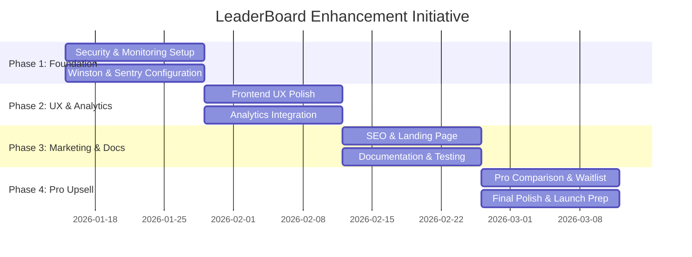

# Epic Brief: LeaderBoard Pro Launch Enhancement Initiative

# Epic Brief: LeaderBoard Pro Launch Enhancement Initiative

## Problem Statement

The LeaderBoard Lite (open-source) version has a solid MVP foundation with core real-time leaderboard functionality, Railway.io deployment, and demo mode. However, to successfully launch the Pro version and drive conversions, the Lite version needs comprehensive enhancements across security, scalability, UX, documentation, analytics, SEO, and Pro upsell mechanisms.

**Current State:**
- ✅ Core features working (real-time updates, Redis, Socket.io, demo mode)
- ✅ Basic security (rate limiting, validation, sanitization)
- ✅ Railway.io deployment configured
- ⚠️ Limited monitoring/observability (Winston and Sentry installed but not configured)
- ⚠️ Minimal documentation (no CONTRIBUTING.md, limited troubleshooting)
- ⚠️ No analytics integration
- ⚠️ Basic mobile responsiveness (needs verification and polish)
- ⚠️ No Pro version upsell mechanisms in place
- ⚠️ Limited test coverage

**Desired State:**
A polished, production-ready Lite version that:
1. Showcases professional quality and reliability
2. Provides clear value proposition for users
3. Creates compelling conversion funnel to Pro version
4. Supports scalable deployments with proper monitoring
5. Offers excellent developer experience with comprehensive docs
6. Enables data-driven iteration through analytics

## Business Context

### Primary Objective
**Launch the Pro version and drive conversions from Lite users** through a comprehensive enhancement initiative over 1-3 months.

### Pro Version Strategy
- **Positioning**: Lite is fully functional for single-game deployments; Pro adds enterprise features
- **Upsell Approach**: Moderate (balanced) - not aggressive, but clear and compelling
- **Pro Features** (from existing README):
  - User Authentication (NextAuth.js)
  - Admin Dashboard (ban players, delete scores)
  - Multi-Tenancy (host multiple games on one instance)
  - Anti-Cheat System (HMAC signature verification)

### Success Metrics
- Lite version adoption rate (Railway.io template deployments)
- Pro waitlist signups
- Conversion rate from Lite to Pro
- User engagement metrics (via analytics)
- Error rates and performance metrics (via monitoring)

## Scope

### In Scope: 7 Enhancement Categories

#### 1. Security Enhancements
- Expand rate limiting to all API endpoints (beyond existing score submission limits)
- Improve admin API key generation with stronger requirements
- Document security best practices in README
- Verify injection protection coverage across all inputs
- **Out of Scope**: JWT authentication, key rotation (keeping it simple)

#### 2. Scalability & Monitoring
- Configure Winston logging with proper log levels, transports, and rotation
- Set up Sentry error monitoring (already installed, needs DSN configuration)
- Add Redis health checks and auto-reconnect logic
- Document horizontal scaling options (Node.js clustering for high-traffic)
- **Out of Scope**: Auto-scaling infrastructure, Kubernetes deployment

#### 3. Frontend UX Polish
- Verify and enhance mobile responsive design (Tailwind breakpoints)
- Add customizable themes/branding via environment variables (colors, logos)
- Implement rank change animations and real-time notifications
- Improve visual engagement for demo/marketing purposes
- **Out of Scope**: Complete redesign, complex animation libraries

#### 4. Documentation & Testing
- Create CONTRIBUTING.md with contribution guidelines
- Expand Jest unit test coverage for backend routes and frontend components
- Add comprehensive troubleshooting section to README (Redis errors, deployment issues)
- Create quick-start video tutorial (embedded via YouTube/GitHub)
- **Out of Scope**: E2E tests (Cypress/Playwright), API documentation beyond Swagger

#### 5. Analytics Integration
- Make analytics configurable via environment variables (provider-agnostic)
- Support multiple providers: Google Analytics, Mixpanel, Plausible, Umami
- Add opt-in telemetry for error reporting
- Document privacy considerations and GDPR compliance
- **Out of Scope**: Custom analytics dashboard, complex event tracking

#### 6. SEO & Marketing
- Add meta tags and Open Graph support in Next.js for social sharing
- Create demo landing page within frontend showcasing features with live examples
- Verify cross-browser compatibility (Chrome, Firefox, Safari, Edge)
- Add accessibility improvements (ARIA labels on tables, keyboard navigation)
- **Out of Scope**: Paid marketing campaigns, SEO optimization beyond basics

#### 7. Pro Version Upsell (Moderate Approach)
- Add upgrade banner on admin page (non-intrusive, dismissible)
- Create feature comparison modal (Lite vs. Pro) accessible from UI
- Implement waitlist signup form/CTA button (link to Gumroad or landing page)
- Add detailed comparison table to README
- Include code hooks/comments for easy Pro upgrades
- **Out of Scope**: Feature gating in Lite, aggressive popups, freemium limits

### Out of Scope
- Breaking changes to existing API contracts (no backward compatibility needed, but maintain consistency)
- E2E testing infrastructure (Cypress/Playwright)
- JWT-based authentication or session management
- Custom analytics dashboard or complex tracking
- Kubernetes/Docker Swarm deployment guides
- Paid marketing or SEO campaigns
- Complete UI redesign or framework changes

## Technical Constraints

### Technology Stack (Existing)
- **Backend**: Node.js, Express, Socket.io, Redis (ioredis), Winston, Sentry
- **Frontend**: Next.js 14, React 18, Tailwind CSS, TypeScript
- **Testing**: Jest (unit tests only)
- **Deployment**: Railway.io with Redis provisioning
- **Monitoring**: Winston (logging), Sentry (error tracking)

### Principles
- **Stick with existing stack** - no new major dependencies
- **Provider-agnostic** - make analytics and monitoring configurable
- **Developer-friendly** - comprehensive docs, clear examples
- **Production-ready** - proper error handling, logging, monitoring
- **Conversion-focused** - strategic Pro upsell touchpoints

## Timeline & Phasing

### Multi-Phase Approach (1-3 Months)

**Phase 1: Foundation (Weeks 1-2)**
- Security enhancements (rate limiting, admin key generation)
- Scalability & monitoring setup (Winston, Sentry, Redis health checks)
- **Goal**: Production-ready infrastructure

**Phase 2: UX & Analytics (Weeks 3-4)**
- Frontend UX polish (mobile responsive, themes, animations)
- Analytics integration (configurable providers)
- **Goal**: Engaging user experience with data insights

**Phase 3: Marketing & Documentation (Weeks 5-6)**
- SEO & marketing (meta tags, landing page, cross-browser)
- Documentation & testing (CONTRIBUTING.md, troubleshooting, video tutorial)
- **Goal**: Discoverable and well-documented

**Phase 4: Pro Upsell & Launch (Weeks 7-8)**
- Pro version upsell mechanisms (banner, modal, waitlist)
- Final polish and launch preparation
- **Goal**: Clear conversion funnel to Pro

## Success Criteria

### Functional Requirements
- ✅ All 7 enhancement categories implemented and tested
- ✅ Winston logging configured with proper log levels and rotation
- ✅ Sentry error monitoring capturing and reporting errors
- ✅ Redis health checks preventing crashes on connection loss
- ✅ Mobile responsive design verified on iOS and Android
- ✅ Analytics configurable via env vars (at least 2 providers supported)
- ✅ CONTRIBUTING.md and troubleshooting docs complete
- ✅ Pro comparison modal and waitlist form functional
- ✅ Unit test coverage expanded (target: 70%+ for critical paths)

### Non-Functional Requirements
- ✅ Page load time < 2s on 3G connection
- ✅ Zero critical security vulnerabilities (npm audit)
- ✅ Lighthouse score > 90 for performance, accessibility, SEO
- ✅ Cross-browser compatibility verified (Chrome, Firefox, Safari, Edge)
- ✅ Documentation complete enough for new contributors to onboard
- ✅ Pro conversion funnel clear and compelling (user testing feedback)

### Business Outcomes
- ✅ Lite version positioned as professional, production-ready solution
- ✅ Pro version differentiation clear and valuable
- ✅ Waitlist signup mechanism capturing interested users
- ✅ Analytics providing insights for iteration
- ✅ Monitoring enabling proactive issue resolution

## Key Assumptions

1. **No existing deployments** - no backward compatibility constraints
2. **Single maintainer** - documentation and simplicity are critical
3. **Railway.io focus** - primary deployment target (other platforms secondary)
4. **Pro version exists** - features defined, pricing model established
5. **Gumroad/landing page ready** - external waitlist/purchase mechanism available
6. **Video hosting available** - YouTube or similar for tutorial embedding

## Risks & Mitigations

| Risk | Impact | Likelihood | Mitigation |
|------|--------|------------|------------|
| Scope creep across 7 categories | High | Medium | Strict phase boundaries, clear out-of-scope items |
| Analytics provider complexity | Medium | Low | Start with 1-2 providers, document pattern for others |
| Mobile UX issues on real devices | Medium | Medium | Test on real iOS/Android devices, not just emulators |
| Pro upsell feels too aggressive | High | Low | User testing, A/B test banner placement/messaging |
| Winston/Sentry misconfiguration | Medium | Low | Follow official docs, test in staging environment |
| Video tutorial production time | Low | Medium | Keep it simple (screen recording + voiceover), 5-10 min max |

## Dependencies

### External
- Railway.io platform availability
- Sentry account and DSN (free tier sufficient)
- Analytics provider accounts (Google Analytics, Mixpanel, etc.)
- Video hosting platform (YouTube)
- Gumroad or landing page for Pro waitlist

### Internal (Codebase)
- file:backend/src/middleware/rateLimiter.js - expand coverage
- file:backend/src/utils/logger.js - configure Winston
- file:backend/src/config/redis.js - add health checks
- file:frontend/components/ - add Pro upsell components
- file:frontend/app/page.tsx - integrate landing page sections
- file:README.md - expand documentation

## References

- **Current Codebase**: file:d:\Projects\LeaderBoard\
- **Existing README**: file:README.md
- **Backend Package**: file:backend/package.json
- **Frontend Package**: file:frontend/package.json
- **Epic**: epic:74e6825c-8d55-4ab7-9815-849f8855bc05

---

**Document Status**: ✅ Approved  
**Last Updated**: 2026-01-11  
**Owner**: Product/Engineering Lead  
**Reviewers**: Stakeholders aligned via structured interview