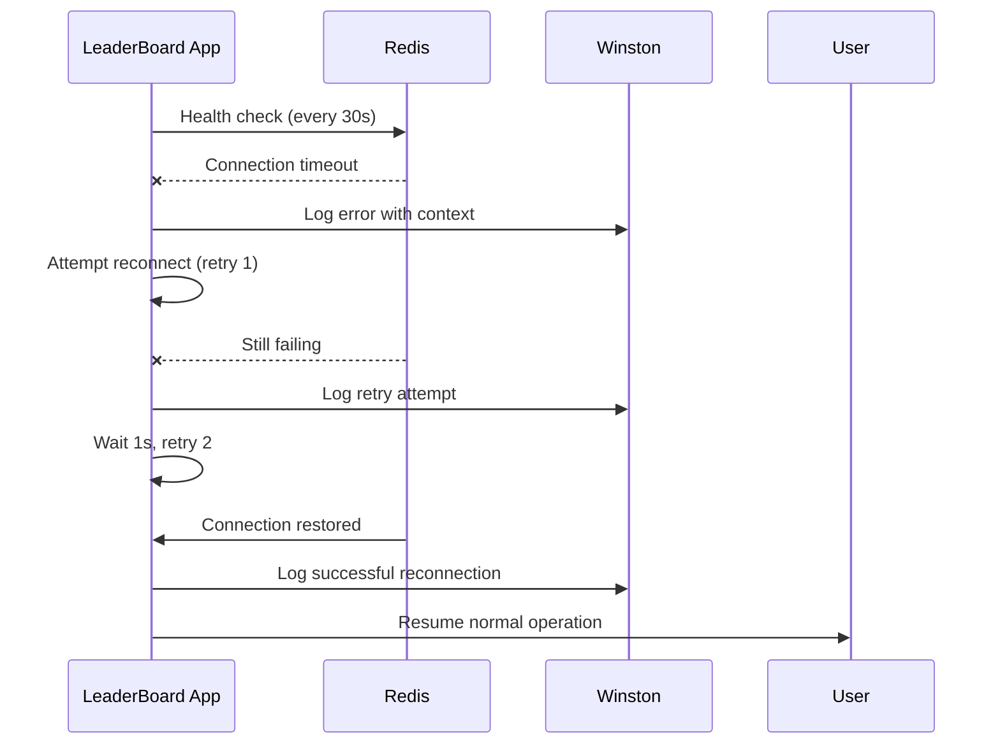

# Add Redis Health Checks and Auto-Reconnect Logic

## Objective
Implement Redis health checks and automatic reconnection logic to prevent application crashes and ensure resilience during Redis connection issues.

## Current State
- ✅ Redis client configured (ioredis)
- ⚠️ No health check mechanism
- ⚠️ No auto-reconnect on connection loss
- ⚠️ Application crashes if Redis becomes unavailable

## Requirements

### 1. Health Check Endpoint
Create `/health` endpoint that checks:
- Redis connection status
- Response time to Redis
- Overall application health

Response format:
```json
{
  "status": "healthy",
  "timestamp": "2026-01-11T10:30:00.000Z",
  "checks": {
    "redis": {
      "status": "connected",
      "responseTime": 5
    },
    "server": {
      "status": "running",
      "uptime": 3600
    }
  }
}
```

### 2. Periodic Health Checks
- Check Redis connection every 30 seconds
- Log warnings if connection is slow (>100ms)
- Log errors if connection fails
- Emit metrics for monitoring

### 3. Auto-Reconnect Logic
- Retry connection on failure (exponential backoff)
- Max retries: 10 attempts
- Initial delay: 1s, max delay: 30s
- Continue serving cached data during reconnection (if possible)

### 4. Graceful Degradation
When Redis is unavailable:
- Return cached leaderboard data (if available)
- Return 503 Service Unavailable for write operations
- Show user-friendly error message
- Continue attempting reconnection in background

### 5. Connection Event Logging
Log all Redis connection events:
- `connect` - Connection established
- `ready` - Client ready to accept commands
- `error` - Connection error occurred
- `close` - Connection closed
- `reconnecting` - Attempting to reconnect
- `end` - Connection permanently closed

## Technical Approach

### Files to Modify
- **file:backend/src/config/redis.js** - Add health checks and reconnect logic
- **file:backend/src/index.js** - Add `/health` endpoint
- **file:backend/src/routes/leaderboard.js** - Add graceful degradation
- **file:backend/src/middleware/errorHandler.js** - Handle Redis errors

### Implementation Steps

1. **Configure ioredis with retry strategy**:
   ```javascript
   const redis = new Redis({
     host: process.env.REDIS_HOST,
     port: process.env.REDIS_PORT,
     retryStrategy: (times) => {
       const delay = Math.min(times * 1000, 30000);
       return delay;
     },
     maxRetriesPerRequest: 3
   });
   ```

2. **Add connection event handlers**:
   - Log all connection state changes
   - Update health check status
   - Emit metrics for monitoring

3. **Create health check function**:
   - Ping Redis with timeout (1s)
   - Measure response time
   - Return structured health status

4. **Add `/health` endpoint**:
   - Check Redis connection
   - Return 200 if healthy, 503 if unhealthy
   - Include response time and uptime

5. **Implement periodic health checks**:
   - Run every 30 seconds
   - Log warnings for slow responses
   - Track connection stability

6. **Add graceful degradation**:
   - Cache last successful leaderboard response
   - Serve cached data if Redis unavailable
   - Return 503 for write operations

## Acceptance Criteria
- [ ] `/health` endpoint returns Redis connection status
- [ ] Health check runs every 30 seconds
- [ ] Redis connection retries on failure (exponential backoff)
- [ ] Max 10 retry attempts before giving up
- [ ] All connection events logged via Winston
- [ ] Application doesn't crash when Redis disconnects
- [ ] Cached leaderboard data served during Redis downtime
- [ ] Write operations return 503 when Redis unavailable
- [ ] Connection automatically restored when Redis comes back
- [ ] README documents health check endpoint

## Health Check Endpoint Example

```javascript
// file:backend/src/index.js
app.get('/health', async (req, res) => {
  const health = {
    status: 'healthy',
    timestamp: new Date().toISOString(),
    checks: {
      server: {
        status: 'running',
        uptime: process.uptime()
      }
    }
  };

  try {
    const start = Date.now();
    await redisClient.ping();
    const responseTime = Date.now() - start;
    
    health.checks.redis = {
      status: 'connected',
      responseTime
    };
    
    res.status(200).json(health);
  } catch (error) {
    health.status = 'unhealthy';
    health.checks.redis = {
      status: 'disconnected',
      error: error.message
    };
    
    res.status(503).json(health);
  }
});
```

## Error Handling Flow



## Dependencies
- `ioredis` (already installed)
- Winston logging (configured in separate ticket)

## Estimated Effort
**4-5 hours** (Medium ticket)

## Testing Checklist
- [ ] `/health` endpoint returns 200 when Redis connected
- [ ] `/health` endpoint returns 503 when Redis disconnected
- [ ] Stop Redis, verify app doesn't crash
- [ ] Stop Redis, verify reconnection attempts logged
- [ ] Start Redis, verify automatic reconnection
- [ ] Health check runs every 30 seconds
- [ ] Slow Redis response (>100ms) logged as warning
- [ ] Cached leaderboard served during Redis downtime
- [ ] Write operations return 503 during Redis downtime

## Related Artifacts
- **Epic Brief**: spec:74e6825c-8d55-4ab7-9815-849f8855bc05/ada011a7-ac51-4e46-8d4c-2ac6b36eb3bb
- **Core Flows**: spec:74e6825c-8d55-4ab7-9815-849f8855bc05/f6eb9bd3-f412-46c7-8c74-9372e6c0bc50